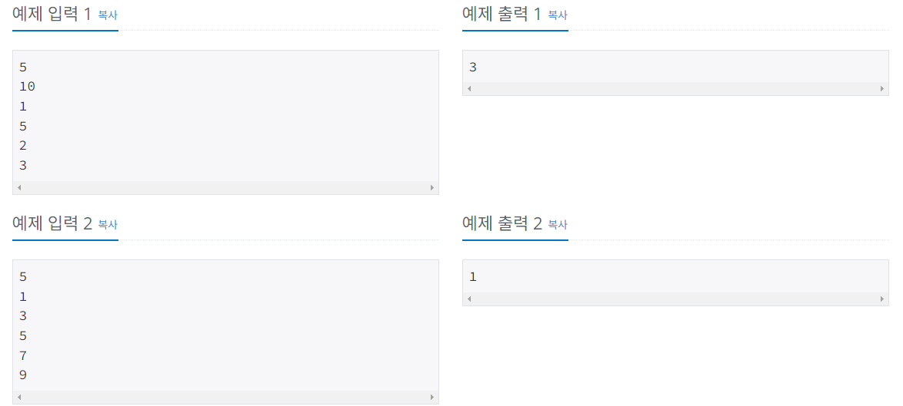

### 📌 출처
[카드2](https://www.acmicpc.net/problem/2164)

### 📝 문제

버블 소트 알고리즘을 다음과 같이 C++로 작성했다.
```cpp
bool changed = false;
for (int i=1; i<=N+1; i++) {
    changed = false;
    for (int j=1; j<=N-i; j++) {
        if (A[j] > A[j+1]) {
            changed = true;
            swap(A[j], A[j+1]);
        }
    }
    if (changed == false) {
        cout << i << '\n';
        break;
    }
}
```
위 소스에서 N은 배열의 크기이고, A는 정렬해야 하는 배열이다. 배열은 A[1]부터 사용한다.

위와 같은 소스를 실행시켰을 때, 어떤 값이 출력되는지 구해보자.

###  ⌨ 입력
첫째 줄에 N이 주어진다. N은 500,000보다 작거나 같은 자연수이다. 둘째 줄부터 N개의 줄에 A[1]부터 A[N]까지 하나씩 주어진다. A에 들어있는 수는 1,000,000보다 작거나 같은 자연수 또는 0이다.


### 🖨 출력
정답을 출력한다.

